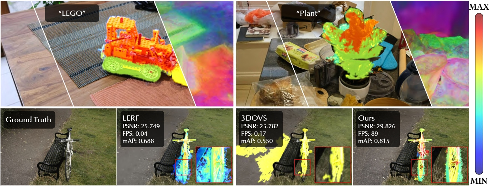

<div align="center">

<h1><b>LEGaussians</b>: Language Embedded 3D Gaussians for Open-Vocabulary Scene Understanding</h1>

<div>
    <a href='https://chuan-10.github.io/' target='_blank'>Jin-Chuan Shi<sup>1</sup></a>&emsp;
    <a href='http://miaowang.me/' target='_blank'>Miao Wang*<sup>1, 2</sup></a>&emsp;
    <a href='' target='_blank'>Hao-Bin Duan<sup>1</sup></a>&emsp;
    <a href='' target='_blank'>Shao-Hua Guan<sup>1</sup></a>&emsp;
</div>
<div>
    <sup>1</sup>State Key Laboratory of Virtual Reality Technology and Systems, Beihang University&emsp; 
    <sup>2</sup>Zhongguancun Laboratory&emsp;
</div>
<div>
    <a href='https://arxiv.org/abs/2311.18482'>CVPR 2024</a>
</div>
<div>

<a target="_blank" href="https://arxiv.org/abs/2311.18482">
  
</a>
<a href="https://hits.seeyoufarm.com"></a>
</div>

<h4>TL;DR</h4>
<h5>We present Language Embedded 3D Gaussians, a novel efficient scene representation for open-vocabulary querying.</h5>

### [Paper](https://arxiv.org/pdf/2311.18482.pdf) | [Project Page](https://buaavrcg.github.io/LEGaussians/) | [Awesome Language Embedded 3D Representations](https://github.com/Chuan-10/awesome-language-embedded-3D-representations)

<br>

<tr>
    
</tr>

</div>

***Abstract**: Open-vocabulary querying in 3D space is challenging but essential for scene understanding tasks such as object localization and segmentation. Language-embedded scene representations have made progress by incorporating language features into 3D spaces. However, their efficacy heavily depends on neural networks that are resource-intensive in training and rendering. Although recent 3D Gaussians offer efficient and high-quality novel view synthesis, directly embedding language features in them leads to prohibitive memory usage and decreased performance. In this work, we introduce **Language Embedded 3D Gaussians**, a novel scene representation for open-vocabulary query tasks. Instead of embedding high-dimensional raw semantic features on 3D Gaussians, we propose a dedicated quantization scheme that drastically alleviates the memory requirement, and a novel embedding procedure that achieves smoother yet high accuracy query, countering the multi-view feature inconsistencies and the high-frequency inductive bias in point-based representations. Our comprehensive experiments show that our representation achieves the best visual quality and language querying accuracy across current language-embedded representations, while maintaining real-time rendering frame rates on a single desktop GPU.*

<details span>
<summary><b>Update Log:</b></summary>
<br>

**April 7, 2024**: 
* Initial release of the LEGaussians repository.

</details>

<br>


## Setup

```bash
git clone https://github.com/buaavrcg/LEGaussians.git --recursive
cd LEGaussians

conda create -n legaussians python=3.8 -y
conda activate legaussians

pip install torch==1.12.1+cu116 torchvision==0.13.1+cu116 torchaudio==0.12.1 --extra-index-url https://download.pytorch.org/whl/cu116

pip install tqdm plyfile timm open_clip_torch scipy six configargparse pysocks python-dateutil imageio seaborn opencv-python scikit-learn tensorboard Pillow==9.5.0

# Install local packages from the 'submodules' directory
# a modified gaussian splatting (+ semantic features rendering)
cd submodules/diff-gaussian-rasterization/ && python -m pip install -e . && cd ../..
# simple-knn
cd submodules/simple-knn/ && python -m pip install -e . && cd ../..
```

## Dataset

Please download the dataset from [the link](https://drive.google.com/drive/folders/1vJ3le9lIGq8zl3ls1OzkBQ-rXLiSSc22?usp=drive_link) and put it in the `./data` directory. The dataset contains six scenes (excluding the Stump) from the [Mip-NeRF 360 dataset](https://jonbarron.info/mipnerf360/) and five scenes (waldo kitchen, bouquet, ramen, teatime and figurines) from the [LeRF dataset](https://www.lerf.io/). Segmentation masks are only provided for the evaluation set. 
You can put the dataset anywhere you want, but you need to modify the `source_path` or `image_dir` in the config files.

## Preproccessing

We extract dense CLIP features and Dino featrues from multi-view images and concatenate them as the dense features. Then, we quantize them and save the feature indices (`xxx_encoding_indices.pt`) and codebook (`xxx_codebook.pt`) in the image root directory for training and evaluation. You can run the following command to preprocess the images. 
 
```bash
cd preprocess
python quantize_features.py --config configs/mipnerf360/xxx.cfg
```

The `xxx.cfg` is the config file for the specific scene. You can find the config files in the `./preprocess/configs/mipnerf360` directory. The `--config` argument specifies the config file you want to use. You can modify the config file to preprocess the features for other scenes or dataset.

## Trianing

We use the `train.py` script to train the model. The config file specifies data and output paths, training hyperparameters, test set, and language feature indices path. The configs for the Mip-NeRF 360 dataset are in the `./configs/mipnerf360` directory. 

```bash
python train.py --config configs/mipnerf360/xxx.cfg
```

You can modify the config file to train the model for other scenes or dataset.

## Rendering

We use the `render_mask.py` script to render rgbs, relevancy maps of text queries, and segmentation masks. The config file specifies the paths, queried texts, test set, rendering parameters and so on. The rendering configs for the Mip-NeRF 360 dataset are in the `./configs/mipnerf360-rendering` directory.

```bash
python render_mask.py --config configs/mipnerf360-rendering/xxx.cfg
```

Because the load of pretained model could be slow, you can modify the `train.py` to render the scene right after training. 

The output will be saved in the root directory of the checkpoint file, and it is orgniazed as follows:
```bash
eval_xxx/
├── gt_images
│   ├── frame_00039.png
│   ├── frame_00059.png
│   ...
├── pred_images
│   ├── frame_00039.png
│   ├── frame_00059.png
│   ...
├── pred_segs
│   ├── frame_00039
│   │   ├── big white crinkly flower.png
│   │   ├── bouquet.png
│   │   ...
│   │   ├── distr
│   │   │   ├── big white crinkly flower.png
│   │   │   ├── bouquet.png
│   │   │   ...
│   ...
│   └── texts_dict.json
├── relevancy
│   ├── frame_00039
│   │   ├── array
│   │   │   ├── big white crinkly flower.npy
│   │   │   ├── bouquet.npy
│   │   │   ...
│   │   └── images
│   │       ├── big white crinkly flower.png
│   │       ├── bouquet.png
│   │       ...
│   ...
```

## Evaluation

We use the `eval.py` script to evaluate the rendering results. Now, we need copy the segmentation masks from the dataset to the output directory and run the following command to evaluate the rendering results. In the future, we will optimize the evaluation process. The path is the output directory of the rendering results.

```bash
cp -r data/xxx/segmentations output/eval_xxx
python lem_metrics.py --path output/eval_xxx
```

After evaluation, you can get the visual quality and language querying accuracy of the rendering results. And detailed results of language metrics will be saved in the `lem_metrics.json` and `mAP_metrics.json` in the output directory.

## TODO List

The repository is currently under construction. We appreciate your patience. Here's the TODO list:
- [ ] Add quantization visualization scripts.
- [ ] Add relevancy maps of text queries visualization scripts.
- [ ] Add LeRF config files.
- [ ] Upload pretrained models.
  
And if you have any questions or suggestions, please feel free to open an issue or a pull request. We are happy to help you.

## Acknowledgement

Credits to the authors for their excellent contributions in the following works:
- [3D Gaussians](https://repo-sam.inria.fr/fungraph/3d-gaussian-splatting/)
- [LeRF](https://www.lerf.io/)
- [VQ-VAE](https://arxiv.org/abs/1711.00937)
- [dino-vit-features](https://dino-vit-features.github.io/)

## Citation

If you find our code or paper useful, please consider citing:
```BibTeX
@article{shi2023language,
  title={Language Embedded 3D Gaussians for Open-Vocabulary Scene Understanding}, 
  author={Jin-Chuan Shi and Miao Wang and Hao-Bin Duan and Shao-Hua Guan},
  journal={arXiv preprint arXiv:2311.18482},
  year={2023}
}
```